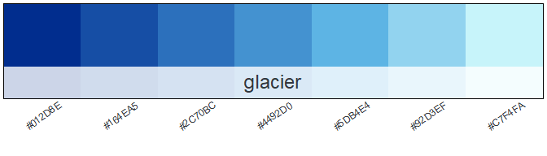
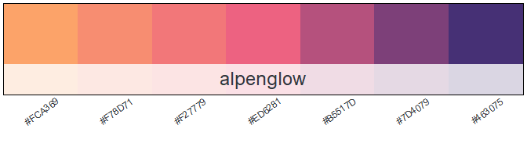
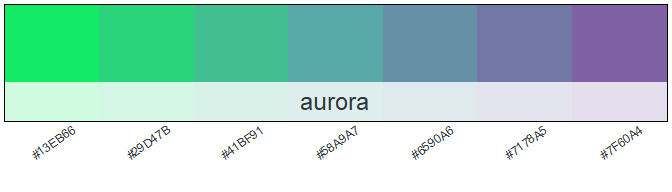
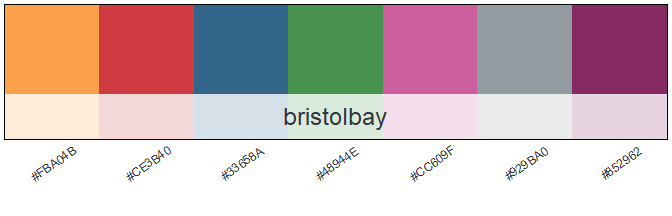

<!-- README.md is generated from README.Rmd. Please edit that file -->

# adfgcolors

<!-- badges: start -->

[](https://www.repostatus.org/#wip)
<!-- badges: end -->

This package allows users to easily add common ADF\&G colors schemes in
ggplot2

Inspired by the amazing packages
[nmfspalette](https://github.com/nmfs-general-modeling-tools/nmfspalette)
and [PNWColors](https://github.com/jakelawlor/PNWColors). Much of the
code from this package is from nmfspalette, written by [Christine
Stawitz](https://github.com/ChristineStawitz-NOAA).

## Installation

You can install the development version from
[GitHub](https://github.com/) with:

``` r
# install.packages("devtools")
devtools::install_github("justinpriest/adfgcolors")
```

## Example

This is a basic example which shows you how to solve a common problem:

``` r
library(adfgcolors)
library(ggplot2)
ggplot(mpg, aes(manufacturer, fill = manufacturer)) +
  geom_bar(color = "black") +
  theme(axis.text.x = element_text(angle = 45, hjust = 1)) +
  scale_fill_adfg(palette = "glacier", discrete = TRUE)
```


## Palette Choices

Colors are generally divided into two categories, discrete and
continuous. Palettes are able to be used as either type, though
generally the palettes described below as discrete display best when
plotted for discrete data.

### Continuous (Sequential) Palettes



### Discrete (Categorical) Palettes


