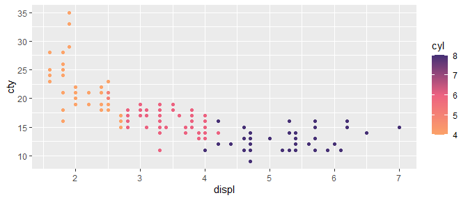
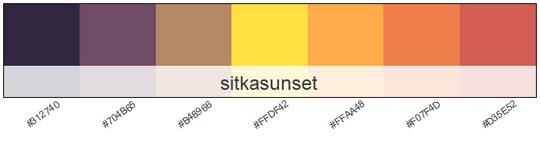
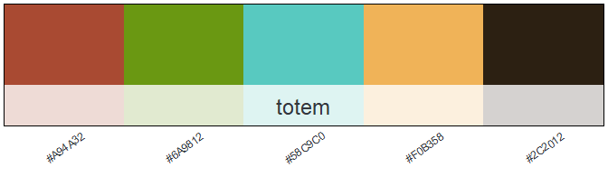
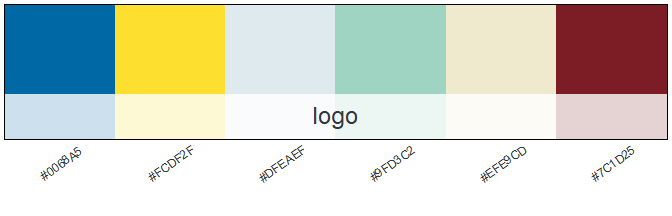
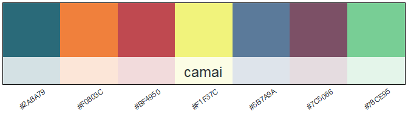

<!-- README.md is generated from README.Rmd. Please edit that file -->

# adfgcolors

<!-- badges: start -->

[](https://www.repostatus.org/#wip)

<!-- badges: end -->

This package allows users to easily add useful and aesthetic colors
schemes in ggplot2. Influenced by the amazing packages
[nmfspalette](https://github.com/nmfs-general-modeling-tools/nmfspalette)
and [PNWColors](https://github.com/jakelawlor/PNWColors). Much of the
code for this package is from nmfspalette, written by [Christine
Stawitz](https://github.com/ChristineStawitz-NOAA).

adfgcolors is still in active development with new palettes being added.
adfgcolors is not endorsed by ADF\&G.

## Installation

You can install the development version from
[GitHub](https://github.com/) with:

``` r
# install.packages("remotes")
remotes::install_github("justinpriest/adfgcolors")
```

## Example Usage

adfgcolors allows you to quickly specify color palettes in ggplot by
using the functions `scale_fill_adfg()` and `scale_color_adfg()`, shown
below:

``` r
library(adfgcolors)
library(ggplot2)
ggplot(mpg, aes(class, fill = class)) +
  geom_bar(color = "black") +
  theme(axis.text.x = element_text(angle = 45, hjust = 1)) +
  scale_fill_adfg(palette = "glacier", discrete = TRUE) 
```


A common need is for plots to be in grayscale, shown here:

``` r
library(adfgcolors)
library(ggplot2)
ggplot(mpg, aes(class, fill = class)) +
  geom_bar(color = "black") +
  theme(axis.text.x = element_text(angle = 45, hjust = 1)) +
  scale_fill_adfg(palette = "grays_bw", discrete = TRUE) 
```


The color aesthetic is easy to modify:

``` r
library(adfgcolors)
library(ggplot2)
ggplot(mpg, aes(x=displ, y = cty, color = cyl)) +
  geom_point() + 
  scale_color_adfg(palette = "alpenglow", discrete = FALSE) 
```



Often, discrete variable plots look best if the exact order of colors
are used (no interpolation), using argument `useexact = TRUE`:

``` r
library(adfgcolors)
library(ggplot2)
ggplot(mpg, aes(drv, fill = drv)) +
  geom_bar(color = "black") + 
  scale_fill_adfg(palette = "bristolbay", discrete = TRUE, useexact = TRUE) 
```


<br>

## Palette Choices

Colors are generally divided into two categories, discrete and
continuous. Palettes are able to be used as either type, though palettes
described below as discrete display best when plotted for discrete data.
Palettes are shown with hex codes for use in manual plotting, if
desired. To show palettes, use function `display_palette()`.

### Continuous (Sequential) Palettes



<br>

### Discrete (Categorical) Palettes

*Consider using argument* `useexact = TRUE` *when plotting discrete
variables as it will use the exact order of palettes shown below.*


### Other Palettes

**More continuous palettes**  


**More discrete palettes**


## Show Palette

Before plotting, you can show the palette using function
`display_palette()`. The arguments for this are the palette name and the
number of colors to display. The associated “hex codes” are shown to
assist users who may want to manually select colors for use in their own
palette.

``` r

display_palette("denali", 7)
```


